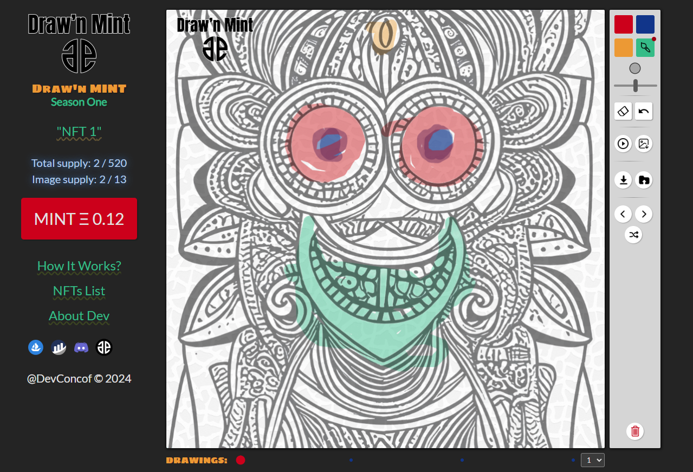

# Draw'n Mint

Welcome to the **Draw'n Mint** project, an innovative Web3 project designed to revolutionize the way we interact with NFTs (Non-Fungible Tokens) on the Ethereum blockchain. This project empowers users to add their creative touch to predetermined images through an online drawing tool and mint their creation as an NFT. It's a venture into combining art, community, and blockchain technology.

## Overview

**Draw'n Mint** is structured in three key components to manage the entire workflow from drawing to minting an NFT:

1. **Smart Contract**
2. **Website**
3. **API**

For detailed contributions and technical information, each component resides in its dedicated folder within this repository.

## Project Description

Designed for deployment on the Ethereum network, and intended for showcasing on OpenSea, **Draw'n Mint** offers a unique scenario. Users can colorize and personalize pre-designed images. These images consist of a background and a foreground, with the coloring occurring in the middle layer. Foreground images are transparent PNGs, allowing for creative flexibility. Sample images can be found in the `api/assets/seasonone` folder.

The project allows for the creation of an infinite number of images and supports custom supply setups. A single smart contract and project configuration can support up to four distinct seasons, each with their own characteristics and rules.

MerkleTree-aided whitelist management is a core feature, ensuring a secure and fair process for participants.

### Smart Contract

Developed for the Ethereum ecosystem, the smart contract is the backbone of the **Draw'n Mint** project. It supports up to four seasons, each with bespoke pricing and whitelist capabilities. The contract is written in Solidity, with Truffle for deployment and management.

The test suite, containing 22 comprehensive checks, ensures the reliability and security of the contract. Additionally, automatic ABI creation is facilitated for integration with the website.

### Website

Constructed using Next.js, the website serves as the gateway for users to interact with the project. It includes:

- Introductory pages about the project.
- Ethereum wallet integration for transactions.
- An online tool powered by the p5 library for coloring images.
- Options to convert the colored image into an NFT and mint it.
- Displays of minted NFTs and their details.

### API

The NodeJS express server powers the back-end functionality, including:

- NFT generation.
- JSON metadata creation.
- A caching system to improve performance.
- Different resolutions for NFT images are supported, facilitating storage on AWS S3.

## NFT Features

NFTs produced by **Draw'n Mint** are truly unique, with traits like Point Count, Line Count, Color Usage Percent, and Dominant Color. They encapsulate the user’s interaction in the form of generative art, with animations showcasing their creation process.

## Licensing

This project is proudly released under the MIT license, allowing free academic and commercial use while exempting me from liabilities arising from its use. For more details, please visit: https://opensource.org/licenses/MIT

## Contributing

I welcome contributions and feedback to enhance **Draw'n Mint**. For any suggestions, issues, or enhancements, feel free to open an issue or submit a pull request. Join me in this fascinating journey where art meets blockchain technology.

Thank you for exploring **Draw'n Mint**. Let’s create and mint together!